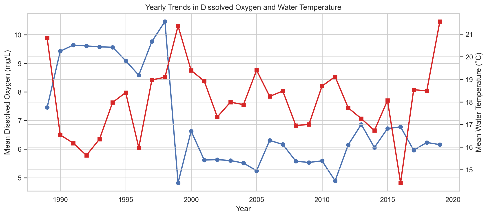
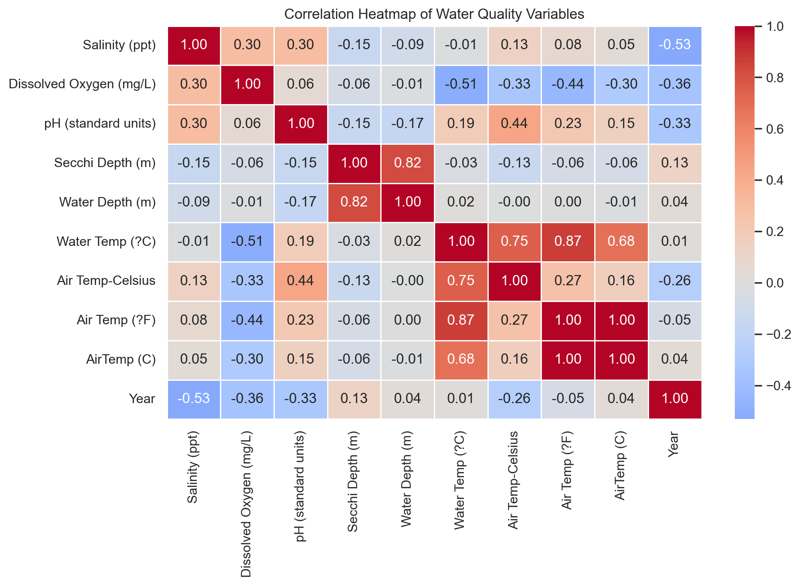
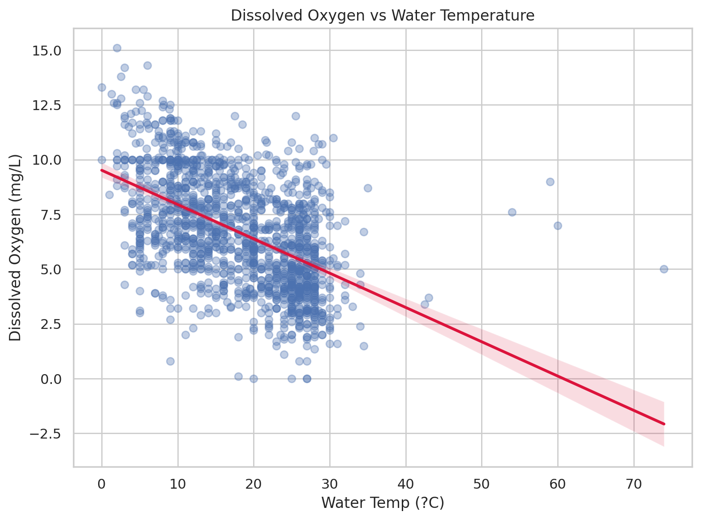
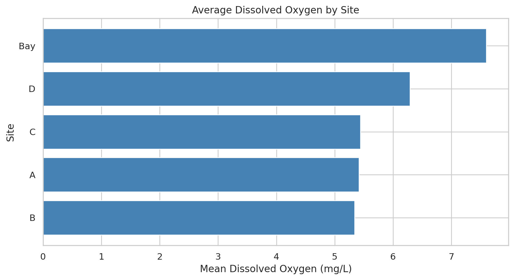
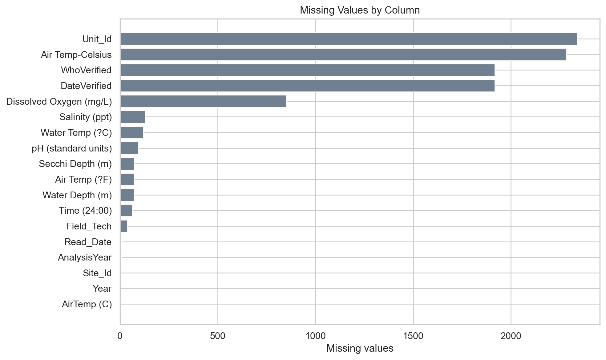

<div align="center">

# 💧 BKB Water Quality Analysis

### Exploratory analysis of water quality trends, site variation, and environmental indicators using Python


</div>

---

# 📖 Project Overview

This project presents a complete exploratory analysis of the BKB water quality dataset.

The goal was to study how dissolved oxygen and other water quality indicators changed over time, compare sites, and identify the main environmental problem supported by the data.

---

# 🎯 Business Problem

**Is water quality declining over time, and which measurable factors are most associated with low dissolved oxygen?**

---

# 📈 Project Statistics

📄 Records Analyzed: **2,371**

📊 Variables: **17**

🧹 Duplicate Records Removed: **0**

❌ Missing Values: **9,981**

📅 Analysis Year Range: **1989–2019**

🧪 Mean Dissolved Oxygen: **6.65 mg/L**

🌡 Mean Water Temperature: **18.06 °C**

🔍 Strongest Correlation: **Dissolved Oxygen vs Water Temperature (r = -0.51)**

---

# 🔄 Analysis Workflow

1. Data Collection
2. Data Understanding
3. Data Cleaning
4. Exploratory Data Analysis (EDA)
5. Correlation Analysis
6. Site Comparison
7. Problem Identification
8. Root Cause Analysis
9. Recommendations
10. Report Generation

---

# 📂 Dataset

This project uses the BKB water-quality dataset, which includes:

- Site_Id
- Unit_Id
- Read_Date
- Salinity
- Dissolved Oxygen
- pH
- Secchi Depth
- Water Depth
- Water Temperature
- Air Temperature
- Time
- Field Technician
- Verification details
- Year

The CSV is included in the **data/** folder so the analysis is fully reproducible.

---

# 🛠 Technologies Used

- Python
- Pandas
- NumPy
- Matplotlib
- Seaborn
- Jupyter Notebook
- HTML
- Microsoft Word
- Git
- GitHub

---

# 📁 Project Structure

```text
bkb-water-quality-analysis
│
├── data
├── images
├── notebooks
├── reports
├── README.md
├── requirements.txt
└── .gitignore
```

---

# 📓 Analysis Notebook

➡️ **[Open the Jupyter Notebook](notebooks/BKB_Water_Quality_Analysis.ipynb)**

---

# 📊 Visualizations

## Yearly Trends



## Correlation Heatmap



## Dissolved Oxygen vs Water Temperature



## Average Dissolved Oxygen by Site



## Dissolved Oxygen by Decade


## Missing Values by Column



---

# 🔍 Key Findings

- Mean dissolved oxygen was **6.65 mg/L**.
- Mean dissolved oxygen declined from **8.91 mg/L** in the 1990s to **6.10 mg/L** in the 2010s.
- Dissolved oxygen and water temperature had a strong inverse relationship (**r = -0.51**).
- About **27.0%** of observed dissolved oxygen values were below 5 mg/L.
- Site-level oxygen conditions varied noticeably across the monitoring sites.

---

# 🚨 Problem Identified

The main problem is a decline in dissolved oxygen over time, which suggests that water conditions may be becoming less favorable for aquatic life.

---

# 🔎 Root Cause Analysis

- Dissolved oxygen falls as water temperature rises.
- Later decades show lower oxygen readings than earlier decades.
- Some sites consistently perform better than others, showing localized differences.
- Missing values in several fields point to monitoring gaps that should be improved.

---

# 💡 Recommendations

- Increase monitoring during warm periods and at lower-oxygen sites.
- Investigate site-specific drivers such as runoff or circulation.
- Improve the completeness of monitoring records.
- Track dissolved oxygen and temperature together over time.
- Prioritize mitigation where low oxygen is persistent.

---

# 📄 Reports

- 📓 Jupyter Notebook
- 🌐 HTML Report
- 📄 Microsoft Word Report
- 📈 Charts and visualizations

---

# 👨‍💻 Author

**Princetova Toby-Diala**

If you found this project useful, feel free to ⭐ the repository.
